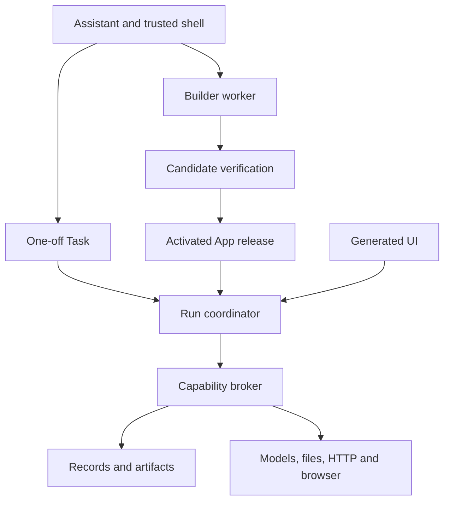

# System architecture

Baseline R2 · 24 September 2026. This file owns component responsibilities and trust/dependency boundaries. The release specification owns normative payloads and state transitions; the implementation plan owns delivery order. No component is claimed implemented by this design.

## The central architecture

Alpha is a creation-and-execution platform. The assistant determines the user's outcome and either invokes existing capabilities or asks a builder to create a candidate solution. Core verifies candidates and owns activation. The same execution system runs one-off Tasks and reusable App actions. UI is optional and never owns authority.

The diagram shows logical calls, not separate deployed services. Core is one modular process. Builder, generated code, complex parsers and browser runtimes have separate supervised execution profiles. The host controls native lifecycle; the broker controls resource/account authority.

## Ownership

| Component | Owns | Must not own |
|---|---|---|
| Native host | Window/tray, process lifecycle, OS secret/file adapters, packaged runtime/update integration | User workflow rules or unrestricted commands from generated UI |
| Trusted shell | Conversation, workflow navigation, Activity, connections, approval/change review | Direct database writes or implicit authority from UI text |
| Assistant | Clarification, brief, output choice, planning and bounded tool decisions | Grant creation, effect confirmation, authoritative run state |
| Build service | Workspace lease, harness invocation, validation, attempts and candidate evidence | Production account access or unreviewed activation |
| Builder worker | Candidate source/schema/UI within a permitted toolchain | Live user data, grants, release activation or durable provider secrets |
| Release service | Sealed version, resolved grants/config, compatible activation and rollback | Arbitrary generated migration execution inside Core |
| Run coordinator | Durable execution envelope, steps/events, waits, cancellation and recovery | Business-specific branches for example apps |
| Generated worker | User-specific rules, transformations, optional runtime model reasoning | Ambient filesystem/network, other Apps, secrets or direct control-store access |
| Capability broker/providers | Current policy, scoped resources, external calls, budgets and receipts | Trust in generated effect labels as sufficient authorization |
| Data/artifact services | Validated persistence, revisions, queries, provenance, export and retention | Coupling user records to replaceable source directories |

## Task, App and Run

An App is a reusable solution containing actions, data definitions, configuration and optional UI/triggers. A Task is one-off work with immutable revisions and attempts. Both produce Runs with a discriminated owner identity. Task retries never invent an App to reuse execution. Temporary generated code for a Task uses the same worker boundary and retained attempt evidence; it is not automatically a saved App.

An action has an input/output schema, real callable binding, declared capability needs and effect metadata. Assistant, UI and schedules invoke the same action gateway. Core authenticates the caller, validates arguments, resolves current authority and starts a durable run. Generated UI cannot call internal services directly.

## Creation and change

The assistant creates a SolutionBrief from goals and selected evidence. The builder receives a sanitized context snapshot, SDK/kit documentation, dependency profile, acceptance examples and budget. It produces source only. Validation resolves real bindings, exercises behavior and UI, and emits evidence. Core seals a passing candidate as an immutable Version. Activation resolves configuration, compatibility and grants into a Release.

Changes reuse the brief and provenance. Settings can change without a rebuild when the declared schema allows it. Code changes create a new candidate. Schema changes follow migration compatibility policy. Runs pin their release and snapshot. A code rollback switches to a compatible version without altering records.

## Execution and recovery

Use direct service calls and SQLite transactions within Core. Add durable records at real asynchronous boundaries: worker launch, provider call, external effect, user wait, schedule occurrence and activation/migration. Do not implement event sourcing, a distributed bus or a separate workflow DSL merely to model ordinary function calls.

Durable steps have stable keys within a Run. Restart/re-entry can reuse completed step outputs; nondeterministic branches use persisted decisions. Arbitrary program stacks are not resumable. A worker dying after an external dispatch cannot establish whether the external action happened. The broker's effect ledger, idempotency and reconciliation determine the next safe action.

## Capability extensibility

Capabilities expose versioned input/output schemas, resource/destination scope, effect policy, connection requirements, budget and evidence behavior. New service support belongs in a shared provider when it introduces new authority or protocol behavior. Generated code may compose existing qualified HTTP/browser operations for a new site; it cannot grant access or install a privileged native provider itself.

Records/tables are a common substrate, not the definition of a module. A useful provider can produce only a file, perform a bounded action or emit a notification. Avoid a separate lifecycle for “Module,” “Agent” or “Workflow” until evidence requires one.

## Local first and future deployment

Use logical resource/connection handles in packages. Resolve device paths and secrets at runtime. Keep OS-specific behavior behind host adapters. A future cloud target can replace state/object/secret/worker/schedule adapters while preserving the App/Task model, but it will require identity, tenant isolation and deployment compatibility checks. Local device capabilities cannot be assumed available to an offline cloud worker. No hidden cloud fallback is permitted in this release.

## Shared maintenance boundary

Platform services are maintained centrally; generated packages use exact SDK/UI/module versions and reference immutable managed dependency installations. Separate workers retain separate data, scratch and permissions even when they read the same code. Implementation Blueprint section 10 owns these mechanisms and the upgrade flow. Code reuse never creates cross-App data access or a new service boundary.
